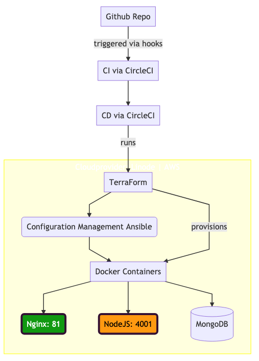
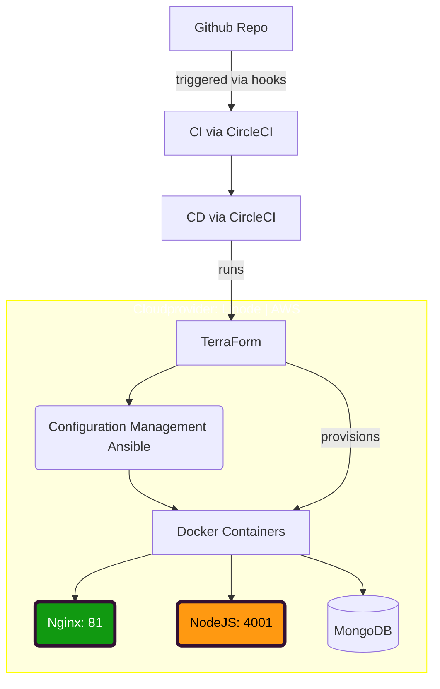
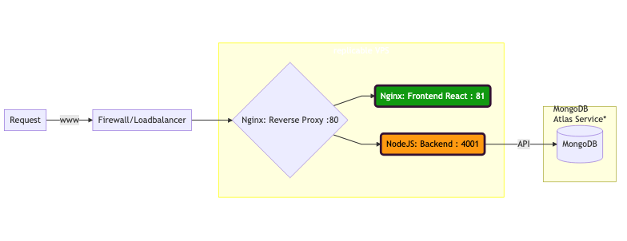

# Konzept DevOps

Author: Falk Neumann
Date: 7.12.2020

## Personal motivation --> Really?
- I want to test out interessting technology which might be relevant for me in the future
- the Cloud Provider should be something else than AWS
- I might try CircleCI, as it has a good free plan and is on vogue
- really wanted to test out Kubernetes for a long time
- BUT: Kubernetes is way to much overhead for this kind of app, only makes sense in multi microservice architecture

## Thinking of the stack
- want to use a cloud native setup
- the development of the app is assumed to happen on a local machine (dev stage with vagrant or local docker)
- environments will be: dev | test? | production
- stages will be: build | test | (deploy?) | production
- app is virtually split into front-end and back-end
- frontend runs on a *nginx* webserver
- backend needs a NodeJS server
- database will be hosted on a separate service (MongoDB Atlas, 200€ Credits via Github Student Pack)
- frontend and backend run on the same vps and communication will be managed by a reverse proxy configuration




  ### Linode Cloud Plattform
  - starting with the cloud provider, since my provisioning tooling has to support it (otherwise I would end up writing providers)
  - linode seems to have a really cheap solutions with 100€ starter-bonus
  - furthermore it seems to be battle tested system with better (personal) sympathy than AWS or GCP, next favorable candidate might be Azure
  - very good documentation
  - really good terraform provider
  - server locations in europe/germany
  
  ### Terraform
  - provisioning will happen via *terraform*
  - it's cloud agnostic, so no vendor lock in etc.
  - terraform is also suitable for setting up a load balancer
  - if there is a benefitial setup I will use **ansible** for *Configuration Management*

  ### VSC
  - the software is managed in a Github Repo
  - CI will be triggered by GitHub Hooks
  
  ### CI / CD
  - I want to test ~~Travis~~ CircleCI for **CI/CD**
  - The CI will have also 3 stages: test / build / deploy
  - after successfully building and testing it will trigger the deployment process
  - the deployment will only start on expected git:tags or if the branch equals "master"

  ### Nginx (frontend)
  - listening on port 80
  - CD has to move the dist folder of the react app into the public html directory
  - nginx setup has to point to that certain folder and serve it
  - nginx has to catch requests which are neither directed to client nor backend-services

  ### NodeJS (backend)
  - listening on own port 4001
  - reached via http calls from the app (defined as "BASE_URL" env variable)
  - the reverse proxy will reach trough requests to the API-Url
  - does not include the mongodb

  ### Database on MongoDB Atlas
  - is an external service which offers a public API
  - therefore I don´t have to setup database clusters by my own
  - I could provision this also by my own, but not sure if this is getting to expensive on Linode
  - alternatively I will provision a MongoDB VPS on AWS
  - seperating the MongoDB from the VPS of the front- & backend gives me more flexebility and the servers (front/back) are absolutley stateless


```mermaid
graph LR
    R[Request] -->|www|C[Firewall/Loadbalancer]
      C-->RP 
      RP-->F
      RP-->B
      B-->|API|DB
    
    subgraph subID[replicable VPS]
      RP{Nginx: Reverse Proxy :80 }
      F(Nginx: Frontend React : 81)
      B(NodeJS: Backend : 4001)
    end
    subgraph MongoDB<br/>Atlas Service*
      DB[(MongoDB)]
    end
    style subID color:white,fill:#f9ff9,stroke:yellow
    style B color:black,fill:#f91,stroke:#313,stroke-width:4px
    style F color:white,fill:#191,stroke:#313,stroke-width:4px
``` 

## Questions and Improvments:
- The (static files of the) react app is going to get served directly via the reverse proxy. Or is it better to spin up another nginx instance for that?
- Is it legit to use MongoDB Atlas as a database service or do I have to provision this by my own?
