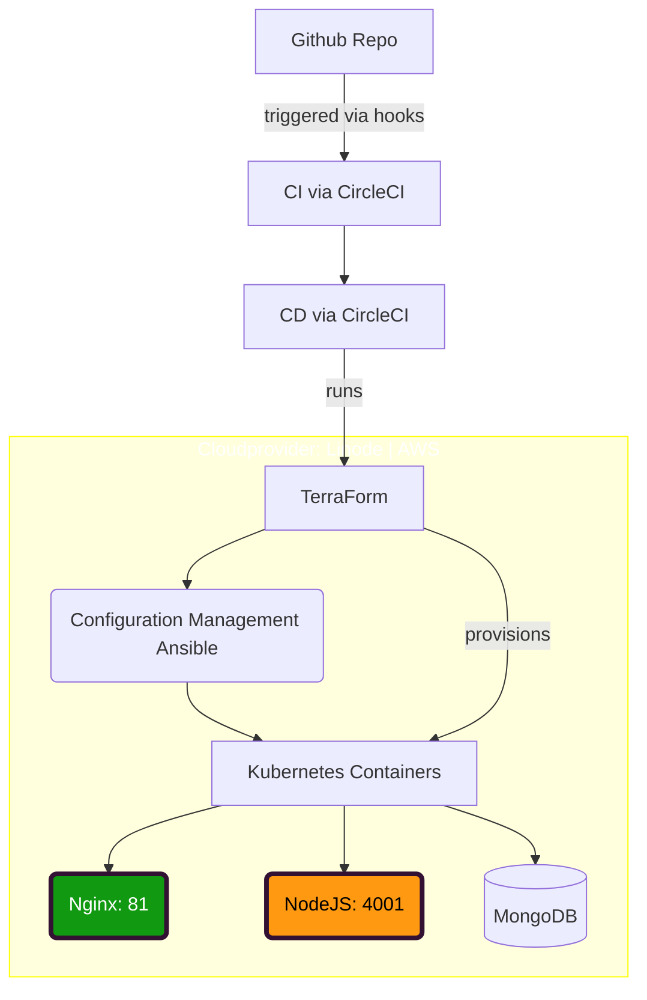
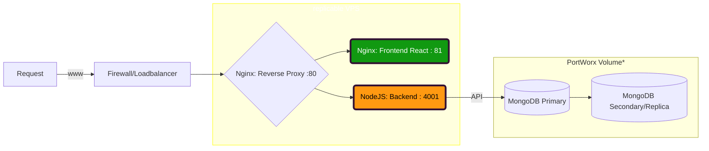

# Konzept DevOps

Author: Falk Neumann
Date: 7.12.2020

## Personal motivation --> Really?
- I want to test out interessting technology which might be relevant for me in the future
- the Cloud Provider should be something else than AWS
- I might try CircleCI, as it has a good free plan and is on vogue
- really wanted to test out Kubernetes for a long time

## Thinking of the stack
- want to use a cloud native setup
- the development of the app is assumed to happen on a local machine (dev stage with miniKube)
- environments will be: dev | test? | production
- stages will be: build | test | (deploy?) | production
- app is virtually split into front-end and back-end
- frontend runs on a *nginx* webserver
- backend needs a NodeJS server
- database will run as a seperate persistence cluster/container
- frontend and backend run on the same vps and communication will be managed by a reverse proxy configuration

<!--  -->

  ### Linode Cloud Plattform
  - starting with the cloud provider, since my provisioning tooling has to support it (otherwise I would end up writing providers)
  - linode seems to have a really cheap solutions with 100€ starter-bonus
  - furthermore it seems to be battle tested system with better (personal) sympathy than AWS or GCP, next favorable candidate might be GCP, but it depends where I can get a free plan
  - very good documentation
  - really good terraform provider
  - server locations in europe/germany
  
  ### Terraform
  - provisioning will happen via *terraform*
  - it's cloud agnostic, so no vendor lock in etc.
  - terraform is also suitable for setting up a load balancer
  - if there is a benefitial setup I will use **ansible** for *Configuration Management*

  ### VSC
  - the software is managed in a Github Repo
  - CI will be triggered by GitHub Hooks
  
  ### CI / CD
  - ~~I want to test CircleCI~~ I will stick with what i kno best for CI/CD: **Gitlab**
  - The CI will have also 3 stages: test / build / deploy
  - after successfully building and testing it will trigger the deployment process
  - the deployment will only start on expected git:tags or if the branch equals "master"

  ### Nginx (frontend)
  - listening on port 80
  - CD (via Ansible) has to move the dist folder of the react app into the public html directory
  - nginx setup has to point to that certain folder and serve it
  - nginx has to catch requests which are neither directed to client nor backend-services

  ### NodeJS (backend)
  - listening on own port 4001
  - reached via http calls from the app (defined as "BASE_URL" env variable)
  - the reverse proxy will reach trough requests to the API-Url
  - does not include the mongodb

  ### MongoDB Peristent Volumen
  - there will be a Persitent Volume (PV) some other pods can claim storage from
  - Perstitent Volume Claims (PVC) will declare their need for memory/cpu, in our case simply 1Gigabyte
  - the setup will consinst of one primary Pod running MongoDB which can replicate data to other secondary volumes
  - I may utilize **portworx** as a block storage layer organiser
  - W.I.P.

<!--  -->

## Questions and Improvments:
- The (static files of the) react app is going to get served directly via the reverse proxy. Or is it better to spin up another nginx instance for that?
- Is is legit to use cloud provider specific kubernertes utilities? (like Linode Kubernetes Engine)
