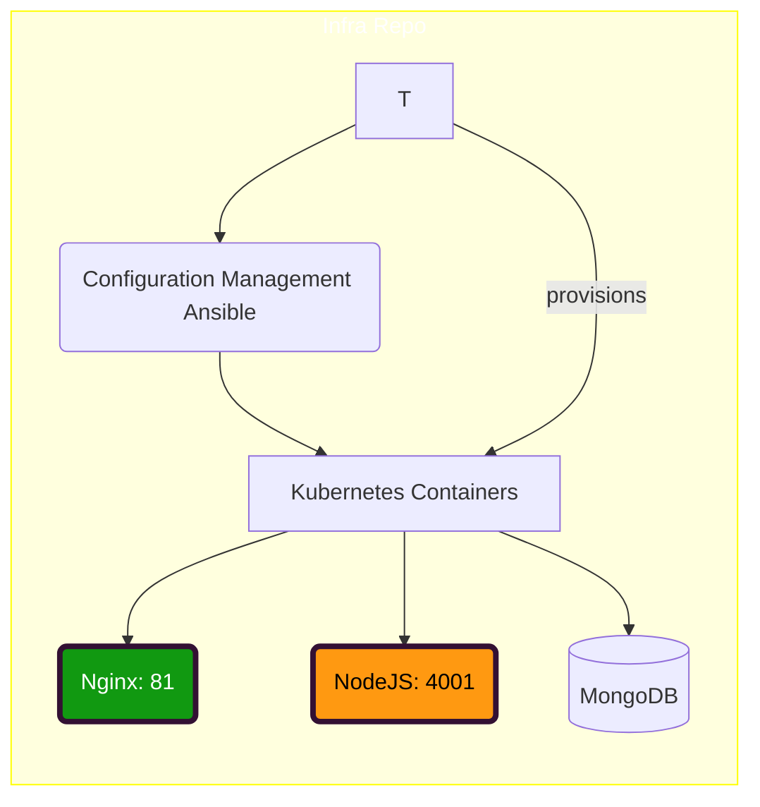

# DevOps Konzept

Author: Falk Neumann
Date: 01.03.2020

## Personal motivation
- worked a lot lately with GitLab and I am quite convinced of the nice workflows and good integration of services
- therefore I want to implement the project in some manners of GitOps
- the cloudservice I wanted to use was actually Linode, but since we have a free AWS account via BTH and lots of companies out there are using it widely, I will stick with AWS for this project
- for the container orchestration I will use Kubernetes, as it is the most prominent cloud orchestration right now

## GitOps
- central to the GitOps build is the usage of Git and Gitlab (Github can be used as well) and the usage of merge-requests for all changes on made to the project
- the build will be splitt into two projects (infrastructure and application code) which are organinized in one repository-group
- the group can shares ressources produced by the different repositories
- the group can can therefore link pipelines
- the group can also organize team members, roles and many more
- ideally the app project will produce a runnable container which will then be used in the infrastructure project via container registry
- the whole cloud infrastructure will be controlled via terraform
<!-- Put some info graphic in here visualizing the whole setup and also the pipeline -->

### The Infrastructure Project
This project will define two clusters: one test cluster and one production cluster. Both clusters will be organized on the aws account. Hopefully there are no limitations which will break with this plan. Otherwhise I have to accquire another test account for another cloud service provider to declare the second cluster. Those clusters represent my two environments: test and production.
On the test cluster, all tests and integration tests will be run.
The prodcution cluster should only get deployed on changes to the main branch or on manual upgrades.

Build into GitLabs cluster functionality there are build in apps which you can run onto of your kubernetes cluster. One of those apps is prometheus, which I want to use as a monitoring tool for both clusters.

### The App Project
Oviously this project will hold all the application code for the front- and backend. Commits to the main branch can trigger deploys to the production cluster. 'normal' commits will start the test suite on a local test environment which will be run inside a gitlab runner. Inside the runnner all the services will run on a single container/runtime environment, since there are no special needs to the gitlab runner, other than nodeJS and monodb. 

It should be possible to run the builds also on the test cluster, but I´m not sure yet what would be the best approach. In the app repository I want to develope the app, not the infrastrucutre. There could be sideeffects when I deploy it to the test cluster and one can not reset it properly. So it can be nice to have this option to test the integration but for actual unit test it's an overkill.

## Workflow

### App Repo
Branch Structure:

Stages:

### Infra Repo
Branch Structure:

Stages:

